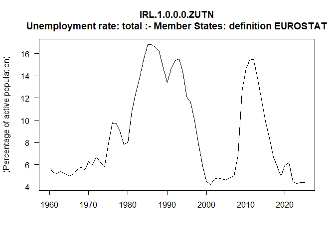

<!-- README.md is generated from README.Rmd. Please edit that file -->

# ecmacro

<!-- badges: start -->
<!-- badges: end -->

An R package for downloading the latest data from the European
Commission’s AMECO macro-economic database.

<https://economy-finance.ec.europa.eu/economic-research-and-databases/economic-databases/ameco-database_en>

## Installation

You can install the development version of ecmacro from
[GitHub](https://github.com/) with:

``` r
# install.packages("pak")
pak::pak("xprimexinverse/ecmacro")
```

## Example

This is a basic example which shows you how to use the package:

``` r
library(ecmacro)

# Download the data
AMECO <- get_ecmacro()

# Search by CODE (1)
ZUTN <- find_series(AMECO, "zutn", field = 1) 

# Extract and plot a series
IRL_ZUTN <- get_series(AMECO, "IRL.1.0.0.0.ZUTN")
```


